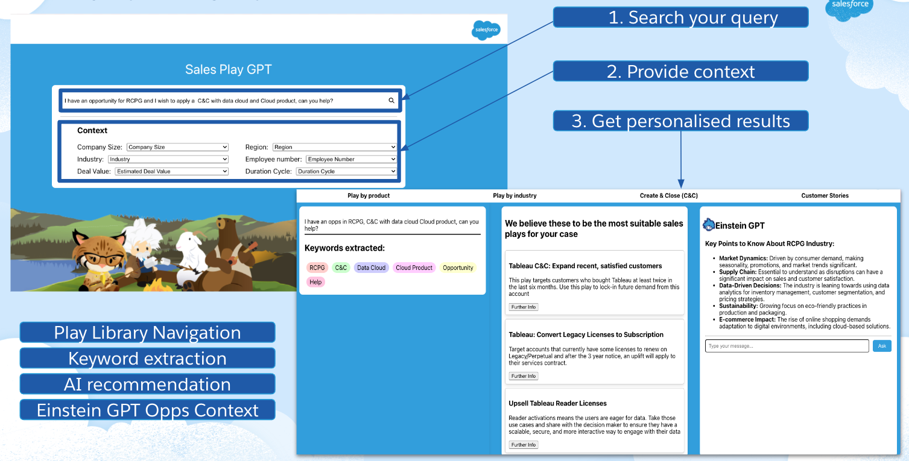

# Demo-Salesplays

A prototype demonstrating a redesigned Sales Play Platform leveraging EinsteinGPT capabilities.



## Project Description

Demo-Salesplays is a front-end React application developed as an external side project while working at Salesforce. It serves as a demonstration for my team and a prototype showcasing how a redesigned Sales Play Platform could function and appear, integrating the power of EinsteinGPT.

## Features

- Interactive Sales Play Management interface
- Integration with EinsteinGPT for enhanced functionality
- Responsive design for various screen sizes

## Prerequisites

Before you begin, ensure you have met the following requirements:

- Node.js
- npm

## Installation and Setup

Follow these steps to get your development environment set up:

1. Clone the repository
   ```
   git clone https://github.com/yourusername/Demo-Salesplays.git
   ```

2. Navigate to the project directory
   ```
   cd Demo-Salesplays
   ```

3. Install dependencies
   ```
   npm install
   ```

4. Start the development server
   ```
   npm start
   ```

5. Open your browser and visit `http://localhost:3000`

## Contributing

As this is a demo project, contributions are not currently being accepted. However, feedback and suggestions are always welcome.

## Acknowledgements

- My Salesforce Sales Programs Team